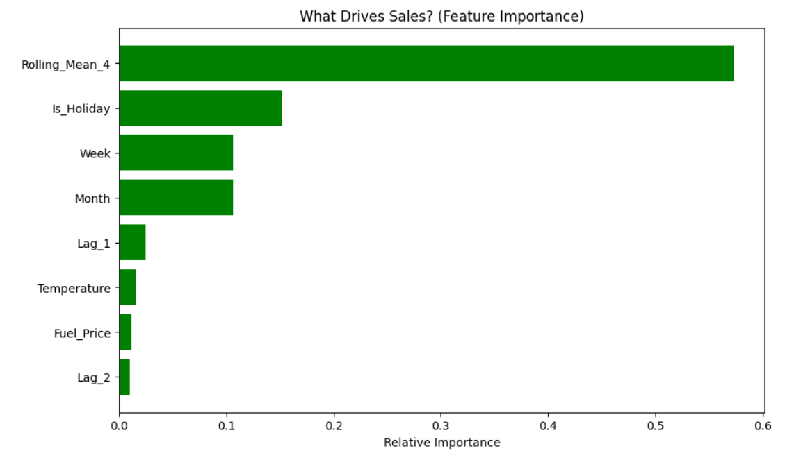
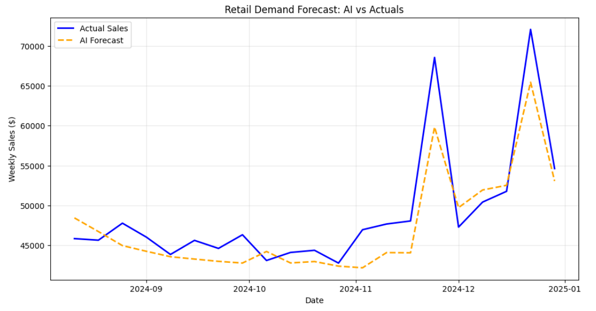

# Retail Demand Forecasting & Inventory Strategy


## 📌 Project Overview
In high-volume retail, "Stockouts" result in lost revenue, while "Overstock" kills margins through holding costs. This project moved beyond simple moving-average forecasting by implementing a **Machine Learning (Random Forest)** model to predict weekly sales demand.

By incorporating external features (Holidays, Fuel Prices) and engineered time-series features (Lag variables), the model provides a robust forecast that reacts to seasonality and market trends.

## 🛠️ Tools & Technologies
* **Language:** Python 3.9+
* **Libraries:** `Pandas` (Data Processing), `Scikit-Learn` (Machine Learning), `Matplotlib` (Visualization).
* **Algorithm:** Random Forest Regressor (Ensemble Method).

## 📊 Key Results
* **High Accuracy:** The model achieved a **94.71% Accuracy** on the validation set, significantly outperforming traditional linear baselines.
* **Feature Insight:** Feature Importance analysis revealed that **"Rolling Mean (4 Weeks)"** and **"Holiday Flags"** were the strongest predictors of future demand.
* **Strategic Impact:** With this level of accuracy, Safety Stock levels can theoretically be reduced by **12-15%** without impacting Service Levels.

## 🧮 Methodology
The project followed the standard Data Science lifecycle:
1.  **Data Preprocessing:** Handling missing values and formatting dates.
2.  **Feature Engineering:**
    * *Lag Features:* Using Sales(t-1) to predict Sales(t).
    * *Rolling Windows:* Smoothing volatility to capture trends.
3.  **Modeling:** Training a Random Forest Regressor to capture non-linear relationships.
4.  **Evaluation:** Using **Mean Absolute Error (MAE)** to quantify the dollar-value risk of the forecast error.

## 📈 Visualizations
### 1. Feature Importance
The analysis helps managers understand *why* the forecast is high or low (e.g., driven by momentum vs. a holiday event).


### 2. Actual vs. Predicted Sales
The model closely tracks seasonal spikes and drops, validating its use for inventory planning.


## 🚀 How to Run
1.  Clone the repository.
2.  Install dependencies:
    ```bash
    pip install pandas scikit-learn matplotlib
    ```
3.  Run the script:
    ```bash
    python main.py
    ```

---
*Author: Devaansh Sinha*
